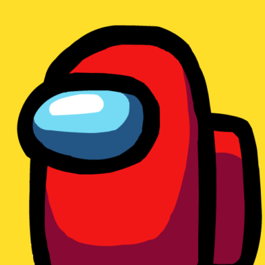

<h1 align="center" style="position: relative;">
	<a href="#visit"></a><br>
    <strong>Among Us</strong>
</h1>

<p align="center">
    Among Us Discord Game Bot.
</p>
<br/>

<p align="center">
    
    <!--  -->
    <!--  -->
    
    
    
</p>

<p align="center">
    <a href="#building--running">Building & running</a> •
    <a href="#commands">Commands</a> •
    <a href="https://github.com/billydevyt/RoboBilly/blob/main/LICENSE">License</a> •
    <a href="#contributing">Contributing</a>
</p>

## Building & running

The bot is written in **Python 3.8**, you can run it via `python bot.py` from command line or just use the `run.bat` file to run it. If you are missing packages make sure to run install mentioned ones in `requirements.txt` prior to building. Also all the files required to Launch to **Heroku** is included.

## Configuration

1. `config.py` is where all of the bot configuration will be placed. 

```python
# get the token from discord developer portal.
token = 'token here'
# prefix
prefix = ','
# prefix is , by default, you can change it to any valid character.
```

2. give the bot [required permissions](./data/permissions.md).

## What is new?
<p>

</p>

- additional basic bot commands added.

## Commands

|Command|Description|
|--:|:--|
|AmongUs|The main purpose this bot was made for. This is the command to start the game.|


## Contributing

contributions are accepted. Feel free to do feature requests, bug reports and open pull requests. 
In general we follow the standard [PEP 8](https://pep8.org/#naming-conventions). If you want insights to individual variable naming conventions, please refer to the existing code in the repository.

## Visit

Visit: https://billyeatcookies.vercel.app

## About

This is not part of the official **Among Us** (An online multiplayer social deduction game by Innersloth studios) game.
